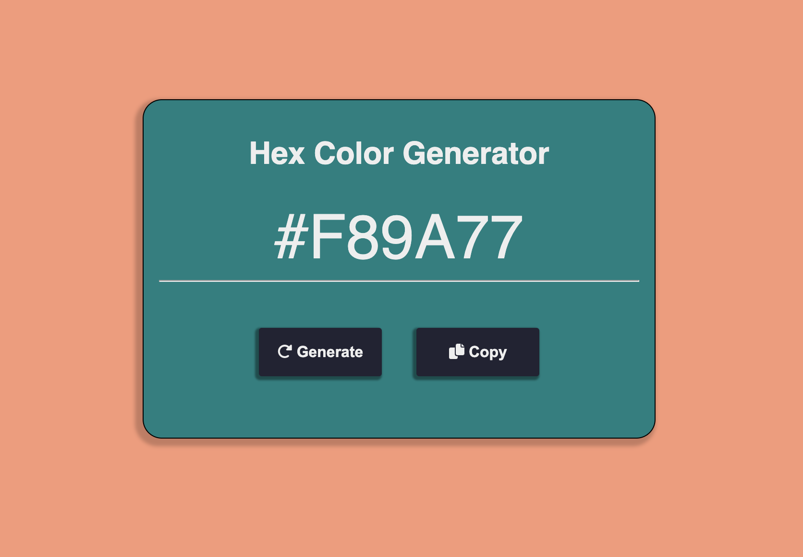

#  Hex Color Generator
## Demo
https://amr-khalil.github.io/Frontend-Projects/hex-color-generator/

## Description
This Project was implemented using Html, CSS, Javascript. It is a generator for hexdecimal colors.

## Features
 - Vanilla JavaScript

## Images

### Main Screen
