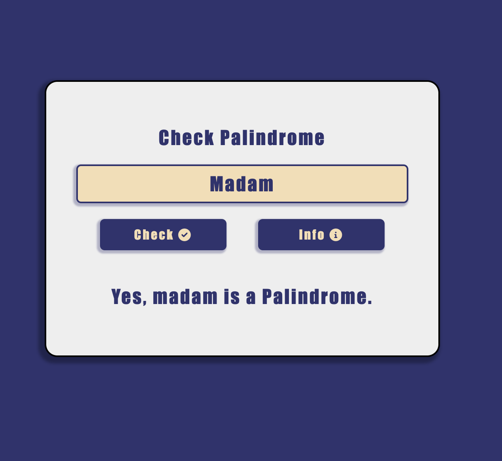
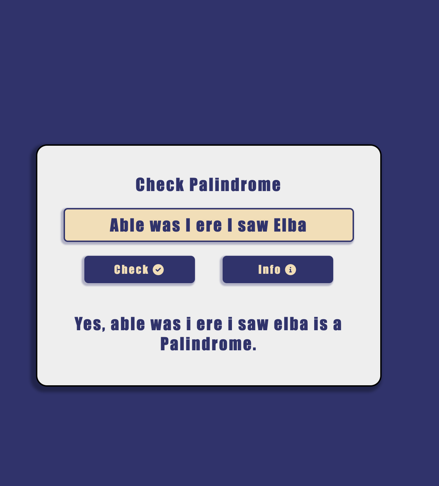
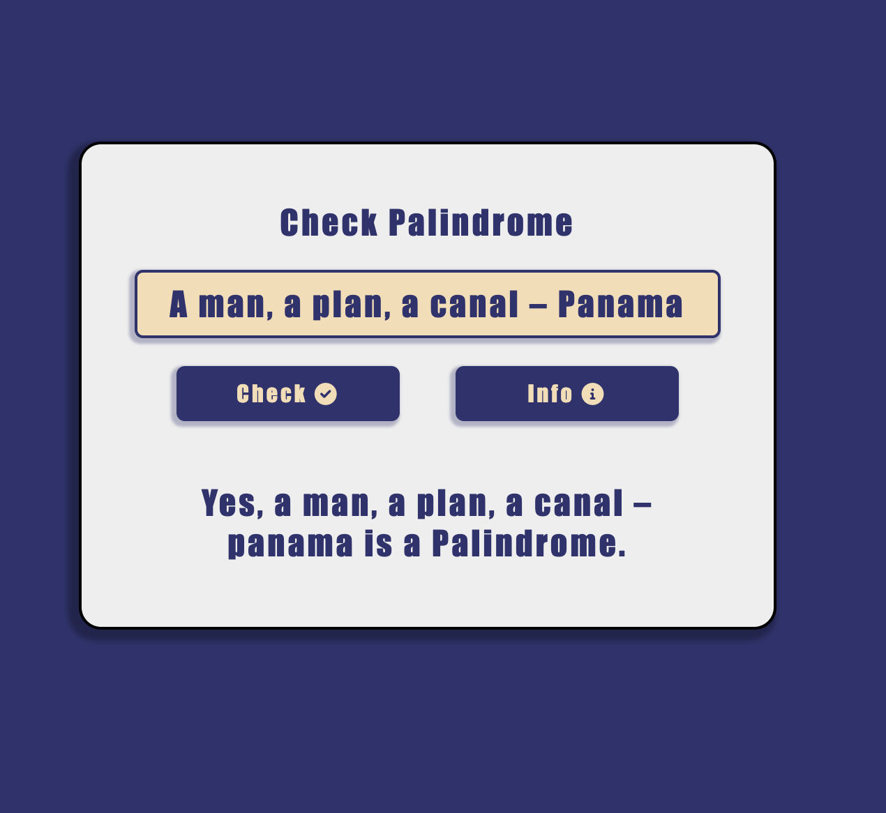
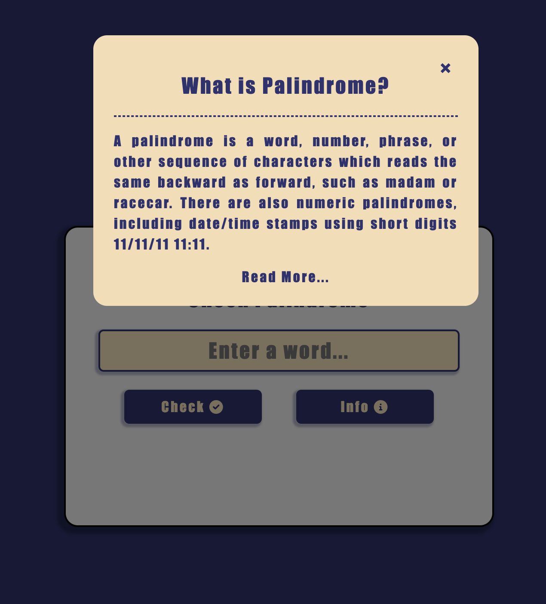

# Palindrome Checker

## Demo
https://amr-khalil.github.io/Frontend-Projects/palindrome-checker/

## Description
This Project was implemented using Html, CSS, Javascript. This app check the palindrome words or numbers. When you click on the button you will get a popup with information about the palindrome.

## Features
 - Vanilla JavaScript

## Images

### Main Screen

