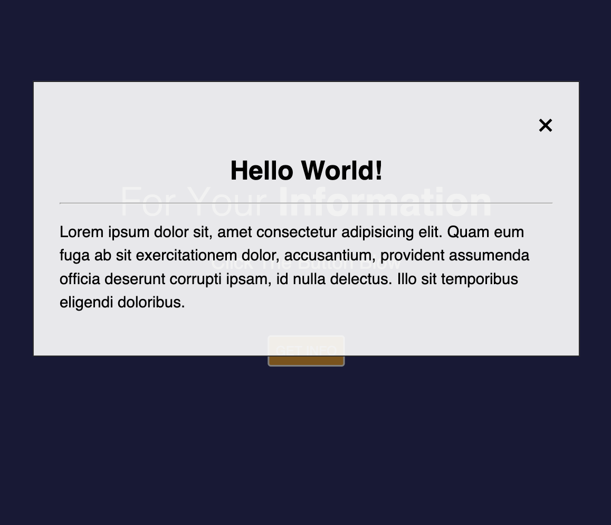

#  Info Popup
## Demo
https://amr-khalil.github.io/Frontend-Projects/info-popup/

## Description
This Project was implemented using Html, CSS, Javascript. When you click on the button you will get a popup with some information.

## Features
 - Vanilla JavaScript

## Images

### Main Screen

